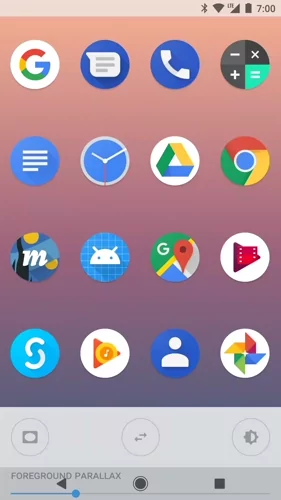

# AdaptiveIconPlayground

An Android application for experimenting with [adaptive icons](https://developer.android.com/preview/features/adaptive-icons.html).



This app finds all installed apps sporting an adaptive icon and displays them in a grid. It then allows you to toggle different mask shapes (approximating how the icon might display on different devices) and explore visual effects may be applied. Currently offered:
- Layer translation parallax based on scroll
- Layer scale parallax based on touch

A settings sheet allows customization of these effects. **Please note** that these effects are purely illustrative and do not reflect any future feature plans. They are fun though 😁.

This app only runs on API26+ devices.

👉 **[Download APK](https://github.com/nickbutcher/AdaptiveIconPlayground/releases)** 👈

Read more about adaptive icons:
- [Understanding Android Adaptive Icons](https://medium.com/google-design/understanding-android-adaptive-icons-cee8a9de93e2)
- [Designing Adaptive Icons](https://medium.com/google-design/designing-adaptive-icons-515af294c783)
- [Implementing Adaptive Icons](https://medium.com/@crafty/implementing-adaptive-icons-1e4d1795470e)

This is not an official Google product.

### License

```
Copyright 2017 Google Inc.

Licensed under the Apache License, Version 2.0 (the "License"); you may not use this file except
in compliance with the License. You may obtain a copy of the License at

http://www.apache.org/licenses/LICENSE-2.0

Unless required by applicable law or agreed to in writing, software distributed under the License
is distributed on an "AS IS" BASIS, WITHOUT WARRANTIES OR CONDITIONS OF ANY KIND, either express
or implied. See the License for the specific language governing permissions and limitations under
the License.
```
